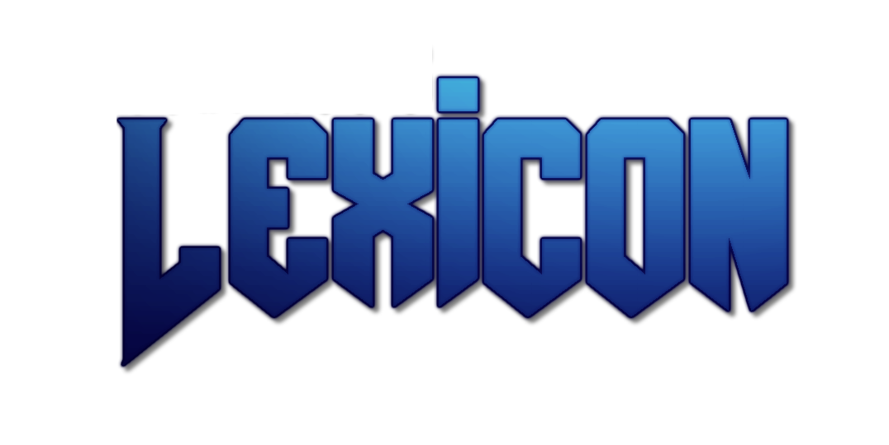

# The Lexicon

Hi there, and welcome!

This project is a megawad complation that contains so many pouplar and fun mapsets. From full megawads to short and sweet mapsets, all is included here.

This will work on Zandronum and UZDoom (or GZDoom..)

Players can select or vote on a mapset in our HUB map!

## What mapsets are in there so far?

This repo is split into multiple packages demarcated by its folders. These packages are:

- Lexicon Core file (core - Main package containing HUB map and code)
- Lexicon Base Pak (lexicon-base - Standard Mapsets)
- Lexicon Slaughter Pak (lexicon-slaughter - Slaughter map Mapsets)
- Lexicon Ultimate Doom Pak (lexicon-ultdoom - Mapsets for the Ultimate Doom IWAD)
- Lexicon DM Pak (lexicon-dm - Deathmatch Mapsets)
- Lexicon CTF Pak - (lexicon-ctf - Capture the Flag Mapsets)

For a list of mapsets please view the credits folder of each pack.

## How to play Lexicon?

You can [Download Latest Release](releases/latest) here. Lexicon runs on a Expansion Pak (Totally not TM'd) system which allows you to mix and match. Depending on what you want, the following load orders are recommended:

### The All-in-One Experience (AIO) for Doom 2

The ultimate package for your Single Player/Multiplayer Experience. Your load order will look like this (eg: if the version is v1.0):

- lexicon-core-v1.0.pk3
- lexicon-base-v1.0.pk3
- lexicon-slaughter-v1.0.pk3
- lexicon-dm-v1.0.pk3
- lexicon-ctf-v1.0.pk3
- (Your mods and extra files here)

If you do not want competitive play, you can exclude the DM and CTF Paks from your load order. This load order however will provide many options to choose from in the case of Mapsets to play.

### Ultimate Doom Only

If you only want to play Ultimate Doom Mapsets, then use this load order:

- lexicon-core-v1.0.pk3
- lexicon-ultdoom-v1.0.pk3
- (Your mods and extra files here)

### The Ultimate AIO Experience for WadFusion

Lexicon also supports WadFusion, providing you are playing on UZDoom (or if needed, GZDoom). You will first need to create your WafFusion IWAD by using [WadFusion](https://github.com/Owlet7/wadfusion) then use this for your IWAD once created. The load order for lexicon will then look like this:

- lexicon-core-v1.0.pk3
- lexicon-base-v1.0.pk3
- lexicon-slaughter-v1.0.pk3
- lexicon-ultdoom-v1.0.pk3
- lexicon-dm-v1.0.pk3 (Remove if you dont want competitive)
- lexicon-ctf-v1.0.pk3 (Remove if you dont want competitive)
- (Your mods and extra files here)

This will offer the ultimate experience, also allowing you to play other IWADS at the same time!

### CVARS for Lexicon

Lexicon has a few CVARS that can alter the experience a bit depending on what you need, importantly controlling should mapset actors (like in Deus Vault II with custom pistols etc) spawn in and be used. Here is a list of these CVARS and what they do.

| CVAR | Accepted Values | Description |
| --- | --- | --- |
| `lexicon_enforcegamemode` | `true/false` | Enforces the gamemode that the game or server has set. Eg: If `survival` is set to `true` then it will lock the gamemode to survival. No one will be able to select a gamemode in the voting menu |
| `lexicon_vanilla_mode` | `true/false` | Changes if actors (if a mapset included them) will be spawned or if the default Doom 2 actors will be spawned instead. If set to true, it will spawn vanilla Doom 2 actors. This setting is a compatiblity setting for various gameplay mods |
| `lexicon_waittimer` | `int` eg: `180` | Controls how long players have to vote a Mapset, in seconds. Shorter numbers means less wait time for players |

### Online play and Hosting a server

The Mythotic TinkerStation hosts official servers on Zandronum. You can search on Doomseeker for these servers by searching `Mythotic` in the search function.

Alternatively, this can be played and hosted on [The Sentinel's Playground](https://allfearthesentinel.net "The Sentinel's Playground") or [FAP's Friendly Action Platform](https://action.fapnow.xyz "FAP")

## How to build the pk3?

In case you would like to compile your own build, you can clone this repo to your local system, then run `Compile.bat` or `Compile.sh` if you are using Linux. The menu system will ask you what you would like to compile or to compile all packs. Just follow the prompts!

## Want to suggest other mapsets or report bugs?

Feel free to use the tracker on here. You can also join our discord at [The Mythotic TinkerStation's Discord](https://discord.gg/mythotic) or [The Backup discord invite](https://discord.gg/mwFZvHe)

## Credits

### Founders/Owners

- MiFU
- Tribeam

### Project Leads/Management

- MiFU
- meleemario

### Lead Developers

- cubebert
- Tribeam

### Scripting / Tooling

- Tribeam
- cubebert
- Shiny Metagross
- Popsoap
- Michaelis
- Penguin

### Mapset Compiling

- cubebert
- Popsoap
- Michaelis
- Shiny Metagross
- meleemario
- Tribeam
- K0RPSE
- tabijaky
- Hell_Pike

### Mapset Selector Code and UI Design

- Shiny Metagross
- Dark-Assassin

### Mapset Selector Sounds

- Idea Factory and Compile Heart (From Hyperdimension Neptunia mk2, ripped by Shiruba)

### VR Hub Design

- Tribeam
- Fiendzy
- cubebert

### VR Hub Fireworks Sounds

- Bizarre Creations (From Boom Boom Rocket, ripped by teh_supar_hackr)

### Beta Testers

- cubebert
- Popsoap
- Shiny Metagross
- meleemario
- Tribeam
- Kaapeli47
- tehvappy50
- Blushberry
- Bugsie
- Challenger
- DEUS VAULT
- Dinosaur Nerd
- Eagle
- Fluffy
- Fookerton
- Gosimer
- Hell_Pike
- ImSoTiredOfBeingHere
- Issac12
- Jaycobe
- Kenopath
- Kunai Kitsune
- Michaelis
- Mister36
- Nash Muhandes
- NationWideMoose
- Penguin
- Professor Renderer
- Saad356
- Shadowlink223
- SyKoTiC
- tabijaky
- Zungling

### Lexicon DM Beta Testers

- [FAP] The Powerful Hoe
- The Proverbial Derp
- Shakar-a'tar
- Mame
- Bathysalts

### Afina Artwork

- Rigrug

### Other Graphics

- BugsBunny205 (Menu Logo)
- Hell_Pike (Brightmaps, GLDefs)
- KillerKouhai (Loading Screen)
- Tiddles (Title Screen / Console background)
- TheMisterCat (Lexicon Cube Artifact)
- Tribeam (Various Font edits and VR GFX)

### Mixed Contributions

(Folks who has done a bit of everything over the lifetime of Lexicon)

- Clint
- Hell_Pike
- Michaelis
- Penguin
- Popsoap
- SeventhSentinel
- Shaewn

### OTEX Textures

- Ola Bjorling

### VR Hub Music

- Jugi
- Daisuke Ishiwatari
- Robert A. Allen & Joshua Jensen
- JazzCat
- 4-Mat
- Yerzmyey
- Amiga Junglism, Spot, XSM & tEiS
- WorkbenchDisease
- Szudi
- Ambient Move
- Big Bear
- Trancerboy
- Gaspode
- Doh
- Necros
- Jester
- Zauron
- Basehead
- Prism
- Jesper Kyd
- Dr. Awesome
- Hunz
- Counterpoint
- Big Jim
- Marvel
- CorgiAtom
- Deathman27
- Maktone
- MrDeath
- Quazar of Sanxion
- Lizardking
- Biteon
- Ko0x
- Xerxes
- Lonestar
- TrAFo in EMC
- Jakim
- LHS
- Jorov
- TSEC
- X-ceed / Scope
- Yoni of Fobia Design
- Seablue
- Beldoroon

### Emotional Support :D

- Ayashi

**Note** - These credits are cut down. More detailed version appears ingame and in the LCREDITS texture in the textures/lexicon folder